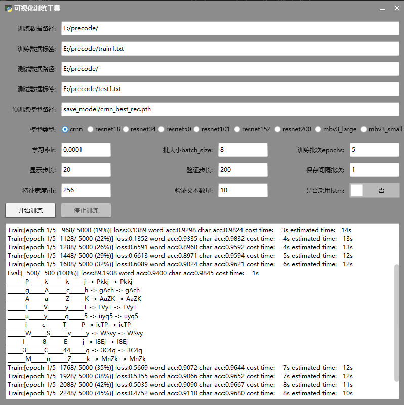

# OCR文本识别可视化训练工具
## 环境
window10 x64

pytorch>=1.8.0

## 简介
OCR模型参考自paddleocr

界面框架采用ExDUIR的python接口 https://gitee.com/william_lzw/ExDUIR 或者 https://github.com/williamlzw/ExDUIR

## 使用方法
运行visual_tools.py方法

## Demo
    